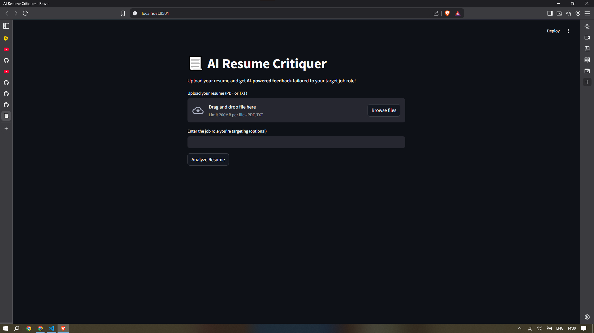
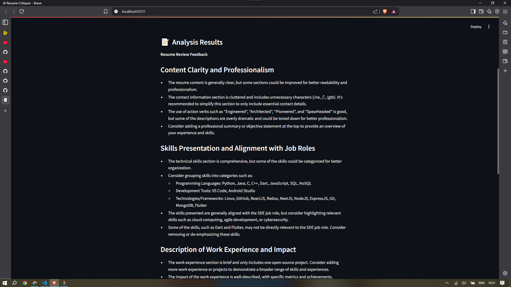

# 📃 AI Resume Critiquer

An AI-powered web app to analyze resumes and provide actionable feedback tailored to your target job role.  
Built with **Streamlit** and powered by **Groq's LLM API** for fast, accurate resume critique.

---

## 🚀 Features

- Upload your resume in **PDF or TXT** format
- Optional input of the **target job role** for personalized feedback
- AI-driven analysis focusing on:
  - ✅ Content clarity and professionalism
  - ✅ Skills presentation and alignment with job requirements
  - ✅ Description of work experience and impact
  - ✅ Suggestions for improving structure, wording, and formatting
- Clean, user-friendly interface built with Streamlit

---

## 📸 Demo

### Upload Screen


### Analysis Output


---

## 🛠️ Getting Started

### ✅ Prerequisites

- Python 3.8 or higher
- Groq API key — [Get yours here](https://groq.com/)

### 📦 Installation

1. **Clone the repository**

   ```bash
   git clone https://github.com/your-username/ai-resume-critiquer.git
   cd ai-resume-critiquer
